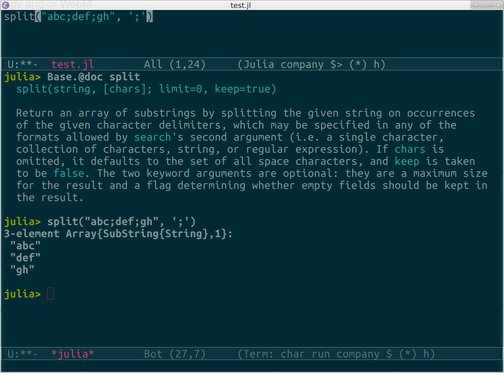

# julia-repl: run an inferior Julia REPL in Emacs

This is a minor mode for interacting with a Julia REPL running inside Emacs. The `julia` process is started in an ANSI terminal (`term`), optionally inside `screen` (when available), which allows text formatting and colors, and interaction with the help system and the debugger.

It is recommended that you use this minor mode with [julia-mode](https://github.com/JuliaEditorSupport/julia-emacs).



## Installation and loading

**Please make sure you have at least Emacs 25**. The `term` code changed a bit since Emacs 24, and the package does not support it. For example, Ubuntu users can get the latest Emacs snapshot [here](https://launchpad.net/~ubuntu-elisp/+archive/ubuntu/ppa).

Place this in your Emacs initialization files (eg `.emacs`):
```lisp
(add-to-list 'load-path path-to-julia-repl)
(require 'julia-repl)
(add-hook 'julia-mode-hook 'julia-repl-mode) ;; always use minor mode
```

## Usage

`M-x julia-repl`, or `C-c C-z` from a buffer in which the `julia-repl` minor mode is active starts a new inferior Julia process. The keys below can be used to interact with this process.

key | action
----|-------
`C-c C-c` | send region (when applicable) or line to REPL
`C-c C-b` | send whole buffer to REPL
`C-c C-z` | raise the REPL or create a new one
`C-RET` | send line to REPL
`C-c C-e` | invoke `@edit` on region (when applicable) or line
`C-c C-d` | invoke `@doc` on symbol

Also, note some keybindings for `term`:

1. `C-x C-j` switches to *line mode*, where you can kill/yank, move around the buffer, use standard Emacs keybindings,
2. `C-c C-k` switches back to *char mode*,
3. for scrolling, use `S-<prior>` and `S-<next>`.

See the help of `term` for more.

You can customize the option `julia-repl-use-screen`. Set it to `nil` (the default) if you want to have the entire history available (`screen` truncates).

## Limitations

- There should be a way to send function definitions without selecting them (ie select around point).
- When not using `screen`, the current implementation redefines `term-mode-map` globally to make arrow keys work.

## Comparison to ESS

A well-known alternative is [ESS](https://ess.r-project.org/), which also supports Julia. `julia-repl` was written because I could not use [Gallium](https://github.com/Keno/Gallium.jl) from ESS, which is based on `comint`, and thus does not allow a fully functioning terminal. Also, relying on the interactive features of the Julia REPL implies that I would not need to change this library to incorporate extensions and changes.
